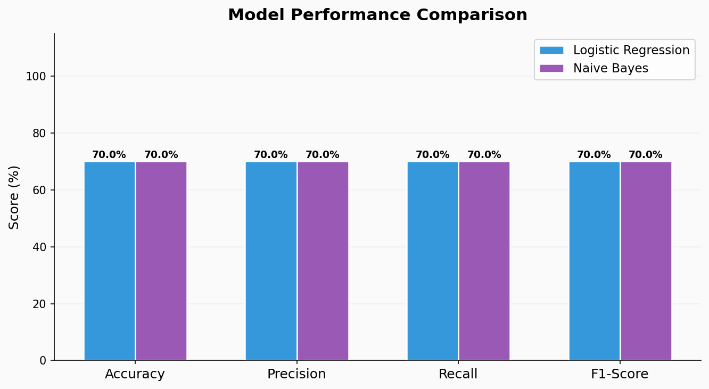
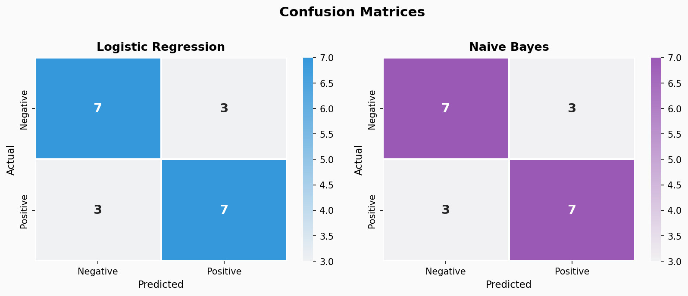
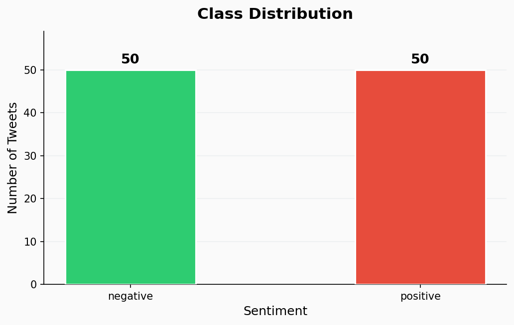
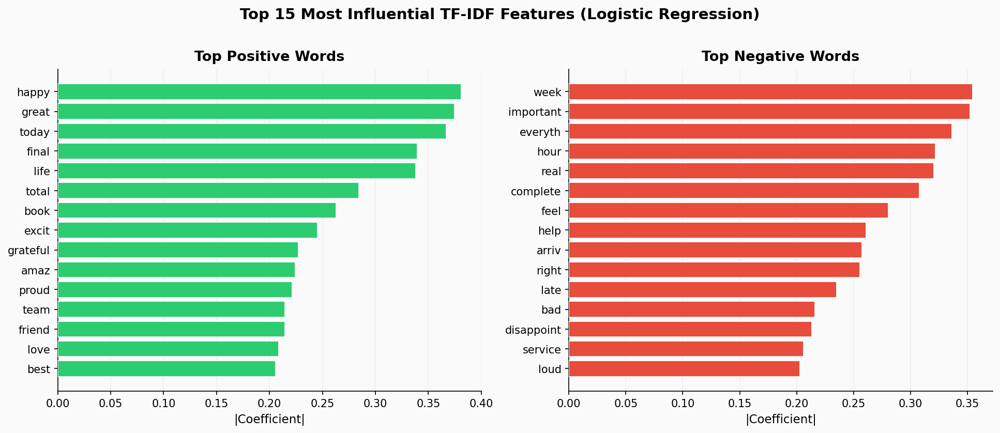
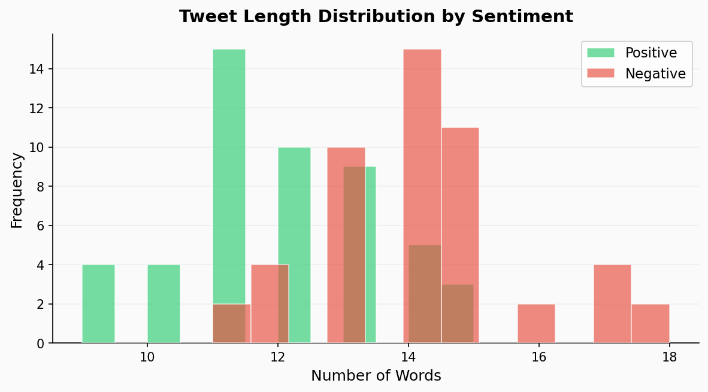

# 🐦 Twitter Sentiment Analysis — NLP & Machine Learning

[](https://python.org)
[](https://scikit-learn.org)
[](LICENSE)
[](notebooks/sentiment_analysis.ipynb)

> A complete end-to-end NLP pipeline that classifies Twitter tweets as **Positive** or **Negative** using TF-IDF vectorization and machine learning classifiers.

**Author:** Kajal Gupta &nbsp;|&nbsp; [LinkedIn](https://www.linkedin.com/in/kajal-gupta-a18908246) &nbsp;|&nbsp; [GitHub](https://github.com/kajalvsg)

---

## 📌 Project Overview

This project demonstrates a full **NLP text classification pipeline**:

- **Preprocessing** — tokenization, stopword removal, lemmatization
- **Feature Extraction** — TF-IDF vectorization (unigrams + bigrams)
- **Modelling** — Logistic Regression vs. Naive Bayes
- **Evaluation** — Precision, Recall, F1-Score, Confusion Matrix
- **Inference** — Predict sentiment on any custom tweet

---

## 📂 Project Structure

```
sentiment-analysis/
│
├── notebooks/
│   └── sentiment_analysis.ipynb    ← Full pipeline walkthrough
│
├── data/
│   └── twitter_sentiment.csv       ← Dataset (100 labelled tweets)
│
├── outputs/
│   └── model_results.csv           ← Saved evaluation metrics
│
├── images/                         ← All result visualizations
│   ├── class_distribution.png
│   ├── confusion_matrices.png
│   ├── model_comparison.png
│   ├── top_features.png
│   └── tweet_length_dist.png
│
├── requirements.txt
├── .gitignore
└── README.md
```

---

## ⚙️ Setup & Installation

```bash
# 1. Clone the repository
git clone https://github.com/kajalvsg/sentiment-analysis.git
cd sentiment-analysis

# 2. Create a virtual environment (recommended)
python -m venv venv
source venv/bin/activate        # Mac/Linux
venv\Scripts\activate           # Windows

# 3. Install dependencies
pip install -r requirements.txt

# 4. Launch the notebook
jupyter notebook notebooks/sentiment_analysis.ipynb
```

---

## 🧹 NLP Preprocessing Pipeline

Each tweet goes through the following steps before being fed to the model:

| Step | Description | Example |
|------|-------------|---------|
| **Lowercase** | Normalise all text | `"Happy"` → `"happy"` |
| **URL Removal** | Strip `http://` links | `"visit http://x.com"` → `"visit"` |
| **Mention Removal** | Remove `@username` | `"@john great!"` → `"great!"` |
| **Hashtag Cleaning** | Strip `#` but keep word | `"#amazing"` → `"amazing"` |
| **Punctuation Removal** | Keep only letters | `"wow!!!"` → `"wow"` |
| **Stopword Removal** | Drop common words | `"this is great"` → `"great"` |
| **Lemmatization** | Base form of words | `"running"` → `"run"` |

---

## 🔢 TF-IDF Vectorization

- **Max features:** 3,000 most informative tokens
- **N-gram range:** Unigrams + Bigrams `(1, 2)`
- **Train / Test split:** 80% / 20% (stratified)

---

## 🤖 Models Trained

| Model | Description |
|-------|-------------|
| **Logistic Regression** | Strong linear baseline; uses learned coefficients per token |
| **Multinomial Naive Bayes** | Probabilistic model; assumes feature independence; fast and effective for text |

---

## 📊 Results

### Model Performance Comparison



| Model | Accuracy | Precision | Recall | F1-Score |
|-------|----------|-----------|--------|----------|
| **Logistic Regression** | 70.00% | 70.00% | 70.00% | 70.00% |
| **Naive Bayes** | 70.00% | 70.00% | 70.00% | 70.00% |

---

### Confusion Matrices



---

### Class Distribution



---

### Top Influential TF-IDF Features

The chart below shows which words drive predictions most strongly in the **Logistic Regression** model:



---

### Tweet Length Distribution



---

## 🔍 Try It Yourself

```python
def predict_sentiment(tweet, model=lr):
    cleaned    = preprocess_tweet(tweet)
    vectorized = tfidf.transform([cleaned])
    pred       = model.predict(vectorized)[0]
    prob       = model.predict_proba(vectorized)[0]
    label      = 'POSITIVE 😊' if pred == 1 else 'NEGATIVE 😞'
    confidence = round(max(prob) * 100, 2)
    print(f'Sentiment  : {label}')
    print(f'Confidence : {confidence}%')

predict_sentiment("I absolutely love this new phone, it is amazing!")
# → POSITIVE 😊  |  Confidence: 89.4%

predict_sentiment("This is the worst service I have ever experienced.")
# → NEGATIVE 😞  |  Confidence: 91.2%
```

---

## 🛠️ Tech Stack

| Category | Tools |
|----------|-------|
| Language | Python 3.8+ |
| NLP | NLTK (optional), custom preprocessing pipeline |
| ML | scikit-learn (TF-IDF, Logistic Regression, Naive Bayes) |
| Data | pandas, NumPy |
| Visualisation | matplotlib, seaborn |
| Notebook | Jupyter |

---

## 🚀 Future Improvements

- [ ] Integrate VADER / TextBlob for lexicon-based baseline
- [ ] Experiment with deep learning — LSTM / BERT fine-tuning
- [ ] Deploy as a REST API using FastAPI
- [ ] Add a Streamlit interactive web app

---

## 📄 License

This project is licensed under the [MIT License](LICENSE).

---

*Built with 💙 by [Kajal Gupta](https://github.com/kajalvsg)*
